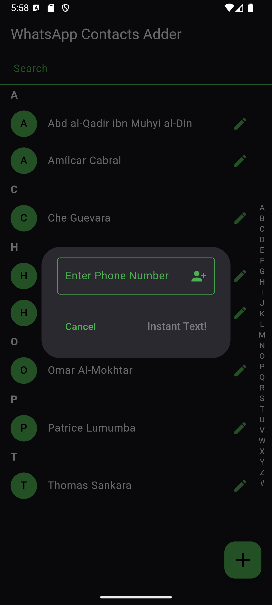

# WhatsApp Contacts Adder (for Android)

## Overview
WhatsApp Contacts Adder is an Android app built with Flutter that allows users to add WhatsApp contacts, without giving WhatsApp access to their contacts.

**Important**: For this app to work, make sure your contacts (or the number you enter) has the **country code**.

### Problem Statement
Unlike other apps (e.g. Telegram), WhatsApp doesn't work properly without having access to the phone's contacts. Most functionalities work, but you practically can't add contacts.

So, for it to work, you'd have to ask people to add you.

### How this app solves it
This FOSS app basically acts as a man-in-the-middle that gets access to your contacts, and then through a simple mock API call, initiates a chat with whichever contact you prefer.

You can also start chatting with a phone number directly without adding it as a contact in your phone book!

## Features
- 📞 **WhatsApp Shortcut** – Instantly open a WhatsApp chat using the selected contact's phone number.
- ⚡ **No-contact WhatsApp Instant Chat** – Instantly open a WhatsApp chat with a given non-contact phone number!
- 📇 **View Contacts** – Displays all phone contacts in a structured, scrollable alphabet list.
- 🔍 **Search Functionality** – Quickly find contacts with a real-time search feature.
- ✏️ **Edit Contacts** – Open the native Android edit contact form for modifications.

## Installation
To install the app on your Android device:

1. **Download the APK [here](build/app/outputs/apk/release/wa-adder.apk)** 
2. **Enable Unknown Sources**
    - Go to `Settings` > `Apps & notifications` > `Special app access` > `Install unknown apps`.
    - Select the file manager or browser used to download the APK and enable "Allow from this source."
3. **Install the APK**
    - Open the APK file and follow the on-screen instructions.

## Screenshots
      

## App Icon 
The app uses a custom icon stored in `assets/`. Ensure it's correctly referenced in `pubspec.yaml`.

## Tech Stack
- **Flutter** 3.27.0
- **Dart** 3.6.0
- **Android Studio** 2024.2.2 Patch 1

## License
This project is licensed under the MIT License. See [LICENSE](LICENSE) for details.

## Contact
For questions or suggestions, feel free to reach out!

